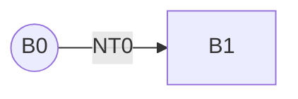
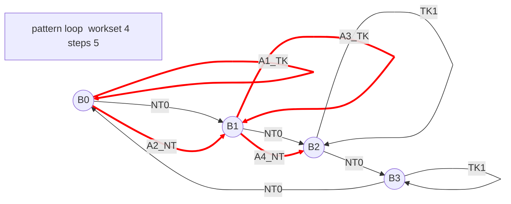

# Branch Pattern Mermaid Notes

`sim/tb/gen_mermaid.py` generates Mermaid diagrams from the same control-flow
rules used by `sim/tb/gen_trace.py`.

The generated text is deliberately conservative Mermaid syntax:

- It outputs raw Mermaid by default, not a fenced Markdown block.
- Static program-space arrows use normal black Mermaid edges.
- Actual dynamic path arrows use thick edges and `linkStyle ... stroke:red`.
- Labels avoid punctuation-heavy forms such as `NT/0` and use `NT0`, `TK1`,
  `A0_TK`, and `A1_NT` instead.

## Generate

```bash
make mermaid_suite
make mermaid MERMAID_PATTERN=loop MERMAID_WORKSET=6 MERMAID_STEPS=12
make mermaid MERMAID_PATTERN=nested MERMAID_WORKSET=6 MERMAID_STEPS=12
make mermaid MERMAID_PATTERN=correlated MERMAID_WORKSET=8 MERMAID_STEPS=12
make mermaid MERMAID_PATTERN=random MERMAID_WORKSET=8 MERMAID_STEPS=12 MERMAID_SEED=3
make mermaid MERMAID_PATTERN=mixed MERMAID_WORKSET=10 MERMAID_STEPS=18 MERMAID_DEEP_LEN=6
```

`make mermaid_suite` writes the standard set of diagrams to:

```text
mermaid_out/
```

Default output path:

```text
mermaid_out/branch_pattern_<pattern>.txt
```

For GitHub Markdown, wrap the generated text manually:

````text

````

For Mermaid Live Editor or `mmdc`, use the raw generated `.txt` contents
directly.

## Space Model

The diagrams separate three related sets.

`full space`: the larger program address/control-flow universe. Nodes named
`F8`, `F9`, and so on are in this full space but not in the current work set.
They are drawn so the reader can see that the benchmark fragment is only a
subset of possible program behavior.

`work set`: the static branch blocks repeatedly exercised by the generated
program fragment. Work-set nodes are named `W0`, `W1`, and so on. Black arrows
are the legal static branch targets inside this work set:

```text
W0 --NT0--> W1
W0 --TK1--> W0
```

`prediction set`: optional blue arrows generated with `MERMAID_PREDICTOR`.
They are not the real RTL predictor state; they are a visualization aid for
showing what it means for a predictor to cover or choose a path.

Actual dynamic execution is shown by thick red arrows. A prediction error is
visible when a blue prediction arrow and the red actual arrow from the same
source node go to different destinations.

Example error/superset diagram:

```bash
make mermaid MERMAID_PATTERN=mixed MERMAID_WORKSET=8 MERMAID_FULLSET=16 \
  MERMAID_STEPS=12 MERMAID_PREDICTOR=always_not_taken \
  MERMAID_OUT=mermaid_out/predictor_error_sets.txt
```

In that example:

- `F*` nodes are full-space-only nodes.
- `W*` nodes are the active work set.
- black arrows are the legal work-set branch space.
- blue arrows are the predictor's selected set.
- red arrows are the actual path.
- blue != red from the same source means wrong prediction.

The standard suite includes three set-relation examples:

```text
07_workset_gt_prediction_set.txt
08_prediction_set_gt_workset.txt
09_predictor_error_sets.txt
```

`07_workset_gt_prediction_set.txt` limits the number of blue prediction edges,
so the work set contains more branch nodes/possibilities than the drawn
prediction set.

`08_prediction_set_gt_workset.txt` uses `MERMAID_PREDICTOR=escape_full`, so
some blue prediction edges point into `F*` nodes outside the active `W*` work
set. This illustrates a predictor set that is larger than, or has escaped, the
current work set.

`09_predictor_error_sets.txt` keeps predictions inside the work set but chooses
a simple always-not-taken policy, making blue-vs-red direction mismatches easy
to see.

## Minimal Example



## Pattern Meaning

`loop`: taken edge returns to the same static branch block; not-taken exits to
the next block.

`nested`: even blocks behave like local loops; odd blocks jump backward on
taken, creating small backward regions.

`correlated`: not-taken walks the ring; taken jumps by
`(idx * 17 + 3) % workset`; direction depends on previous branch result and
current index.

`random`: static targets are deterministic, but actual branch direction is
random.

`mixed`: combines loop-like, correlated, biased, and noisy branches by
`idx % 10`.

`deep burst`: `MERMAID_DEEP_LEN` inserts a branch-only actual path. It models a
dense run of consecutive branches where speculative history can become deep.

## Body Length

`body_len` changes branch density, not static branch target formulas.

With `body_len=0`, branch blocks are adjacent in time:

```text
B0.branch -> B1.branch -> B2.branch
```

With `body_len=4`, each static block contains four non-branch instructions
before its branch:

```text
B0.i0 -> B0.i1 -> B0.i2 -> B0.i3 -> B0.branch -> next block
```

Non-branch rows consume cycles and check PC flow, but they do not update branch
history in the current predictor tests.
